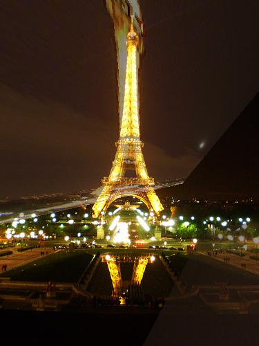
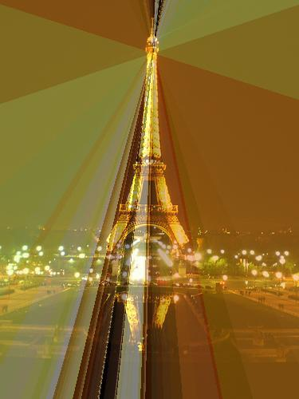
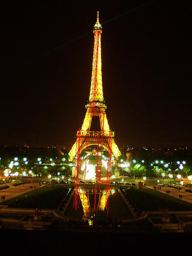
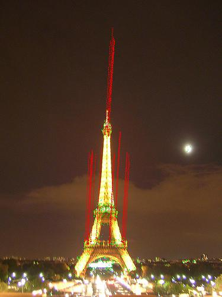
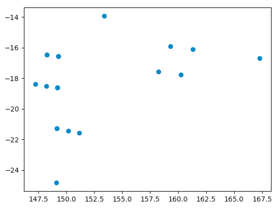

# a2 - Part 1 - Image clustering using ORB

## General Procedure
- Create descritors using ORB
- Run sklearn.Aglomeratice clustering algorithm with the number of given clusters
- used pairwise_distance function to calculate distance matrix
- used the BFMatcher.knnMatch with k=2 and a ratio test with 0.75 threshold
- metric used was merely the total number of matches
- by using mean(distance of matches) / (total distance of all matches) - accuracy increases by 1 % from 81 - 82

## A few observations
- increasing the features from 1000 ( 81 % ) to 2000 ( 82 % ), increases accuracy 1%
- using 'complete' linkage gives the higest accuracy and 'single' gives the lowest
- Accuracy increases to 83.3 % from 81 %
  - using complete linkage
  - 'mean(distance of matches) / (total distance of all matches)'
  - 2000 features ( 83.3 % and 50 seconds TAT )
  - 1000 features - fastest results with a manageable dip in accuracy( 82.4 % 25 seconds TAT )

## Discussion
- ORB uses FAST and BRIEF
  - FAST compares the brightness of a sample pixel 'p' to the surrounding 16 pixels - selects keypoints which are darker than 'p'.
  - for each of these keypoints BRIEF picks two pixels at random from the keypoint's guassian smoothed surrounds
    - the first pixel ( kp1 ) is picked from surroundings smoothed by guassian kernel with SD of 'sigma1'
    - the second pixel ( kp2 ) is picked from surrounds smoothed by guassian kernel with SD of 'sigma2'
    - if kp2 is brigther than kp1 then one of the 128 bits is set to '1' otherwise '0'
  - BRIEF repeats this 128 times
- for images with higher average pixel intensity and similar features, performance tends to drop due to the above procedure of choosing darker or lighter pixels around keypoints.

### False Positives

- Here, the edges and the localities of the keypoints are quite similar. This increases the matching around keypoints since the gradients are similar caussing BRIEF to pick pixels around the key points

### False Negatives

- Here, the edges and the localities around the keypoints have different intensities and hence the procedure fails since decriptor picked has different distances and fails the ratio test.

### FP, FN and TP - Match distance vs Count
#### True postives have the highest good match count

#### FPs and FNs have low good match counts as compared to TPs and TNs

# Part 2 - Image Transformations

Any image transformations can be represented in form of a transformation matrix (usually 3x3). In this section we are doing four different types of transformations - Translation, Euclidian, Affine and Projection. 

Before going into the types of transformations and the results the lincon.jpg was applied with the given transformation matrix and gave the following result.

## Translation 

In this we just have to move the given image a certain units forward or backward in the x or y direction. As mentioned this can be accomplished by using 1 point in the initial image and 1 point in the final image

The transformation matrix would be as follows 

[[1 0 x2-x1]  
[0 1 y2-y1]  
[0 0 1]]

The image book2.jpg was given as input with 2 points and it gave the following output.

## Euclidian Transformation

This is a combination of translation and rotations. In this we can get a matrix with tx = x2 - x1, ty = y2 - y1 and cos a and sin a which is the rotation. This can be done with two points in the original and two points in the final image.

The transformation matrix would be as follows

[[cos(a) -sin(a) x2-x1]  
[-sin(a) cos(a) y2-y1]  
[0 0 1]]

Where there are 4 missing variables and with two points we get 4 equations. This can be solved to obtain the transformation matrix.

The image book2.jpg was given as input with 4 points and it gave the following output.

## Affine Transformation

This is more of a combination of translation, rotation, sheer and scaling in the image. This can be solved using 3 points of the initial image and 3 points of the final image (6 points in total).

If o1,o2,o3 are the points in the original image and t1,t2,t3 are the points in the transformed image the transformation matrix would look as follows

[[o1 o2 o3]  
[t1 t2 t3]  
[0 0 1]]

There are 6 unknown variables and 6 equations and this can be solved using that.

The image book2.jpg was given as input with 6 points and it gave the following output.

Please note that the images are distorted as random points were taken as input for the transformations

## Projective transformation

This transformation is a combination of all the three previous transformations with wrapping. This has 8 unknown variables and can be solved using 4 points which will give 8 equations helping us solve these points.

The equations can be solved using the matrix as follows:

[[a b c]  
[d e f]  
[g h i]]

The image book2.jpg was given as input with 8 points and it gave the following output.

# Part 3 - Automatic Image Matching and Transformations

This is a synthesis of the previous parts. In it, we should find matching features across 2 different images of the same object, transform them into the same coordinate space, and combine them to make a panorama.

## Approach

The general approach of the algorithm was to get ORB matches across two different images, where a match would be when the distance of two points was below a certain threshold.

Then, using those matches, we could use the 4-correspond-points method from part 2 to generate hypotheses. We can determine whether a hypothesis is the same as another from the element-wise summed distance below some threshold.

With these hypotheses, we can run RANSAC to get the final correct transformation matrix, which would transform points from image 1 into image 2.

With this matrix we can take the output to simply be the original image 1, with points from image 2 in our new coordinate space. In instances where images 1 and 2 overlap, we take the average.

## Results

While the idea seems to work very well on paper, the actual results were poor. For some reason, RANSAC returns very different results each run. We experimented with ORB matches, different hypotheses-generating algorithms, and RANSAC parameters.

For certain runs of the program, the result is almost as expected.

However, usually image 2 ends up extremely distorted, like the following:

## Problems

Before ensuring that RANSAC was the problem, I first had to be sure that the ORB matches weren't causing issues. I visualized the matches like this:

As you can see, they line up very well. I also calculated the slope and magnitude of each match, and plotted slope vs magnitude to see if anything stood out. As you can see, nothing really did.

We also thought it could be the fault of our hypothesis-generating method. If the hypotheses we generate aren't consistent, then RANSAC won't be consistent either. We experimented with different 4-point algorithms, although they didn't help the results.

So, RANSAC could be at fault here. The voting system seemed to work, and there weren't any obvious bugs. So, perhaps the hypotheses being generated were too far apart to count as the same one, although they were very close practically. So, I moved up the minimum threshold to be counted as the same hypothesis, but it didn't help. I also tried changing the number of RANSAC rounds from 100 to 1,000. However, the results were just as random as ever.